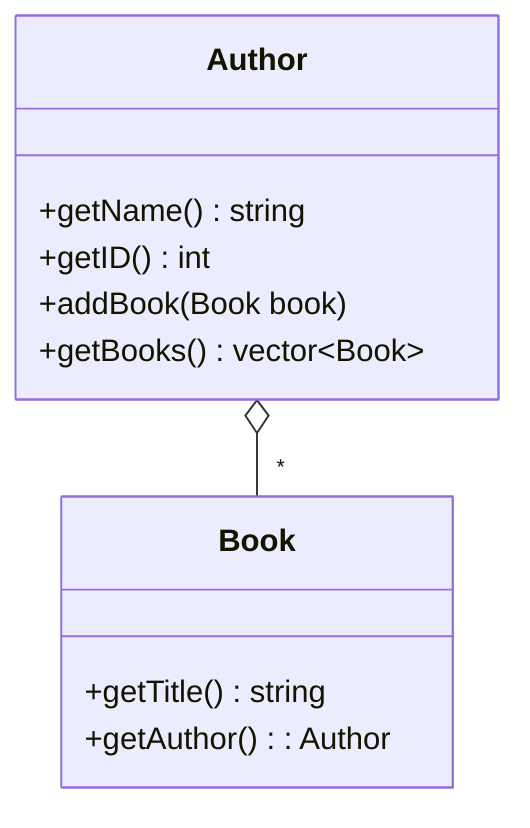

## Author

```mermaid
classDiagram

class Author{
    +getName() string
    +getID() int
    +addBook(Book book)
    +getBooks() vector~Book~
}

class Book{
    +getTitle() string
    +getAuthor(): Author
}

Author o--"*" Book
```